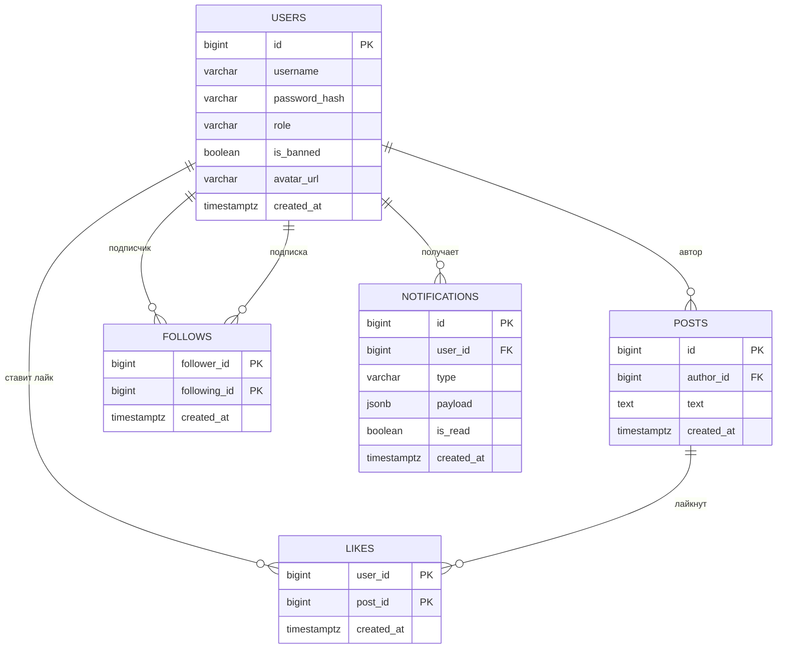

# Лабораторная работа №0

**Тема:** Выбор и описание предметной области. Проектирование функционала приложения.

**Цель:** Сформировать техническое задание к проекту.

---

## 1. Предметная область

**Социальная сеть** — это веб-приложение, в котором пользователи публикуют короткие текстовые посты, подписываются на других пользователей, просматривают ленту постов своих подписок и ставят лайки. Администратор модерирует систему: банит нарушителей и удаляет любой пост.

### Роли в системе

| Роль | Что может |
|---|---|
| **`user`** | Обычный пользователь. Может регистрироваться, публиковать посты, подписываться, лайкать, получать рекомендации и уведомления. |
| **`admin`** | Администратор. Может всё то же самое плюс банить пользователей, разбанивать их, удалять любые посты и просматривать список пользователей. |

### Соответствие требованиям

- **≥ 2 роли** — `user` и `admin`.
- **≥ 3 сущности** — `users`, `posts`, `likes`, `follows`, `notifications` (5).
- **M:N-связи** — `likes` (User ↔ Post), `follows` (User ↔ User).
- **Задачи для gRPC** — рекомендации постов: принимает `user_id`, анализирует историю лайков и подписок, возвращает топ-N рекомендованных постов.
- **Задачи для уведомлений** — лайк, подписка, новый пост, бан: `post.created`, `post.liked`, `user.followed`, `user.banned`.

---

## 2. Бизнес-цель

Предоставить пользователям площадку для публикации коротких текстовых постов и обмена ими с подписчиками, с возможностью получать рекомендации на основе своих интересов и уведомления о событиях в реальном времени; предоставить администратору инструменты модерации.

**Цель измерима:** пользователь может создать пост, подписаться на другого пользователя, увидеть его пост в ленте, лайкнуть его; администратор может забанить пользователя; уведомления о событиях приходят в реальном времени.

---

## 3. Функционал приложения

### 3.1. Для пользователя (роль `user`)

- регистрация и аутентификация;
- просмотр ленты постов тех, на кого подписан;
- создание поста;
- лайк / снятие лайка;
- подписка / отписка;
- просмотр профиля (своего и чужого);
- просмотр рекомендованных постов;
- получение уведомлений в реальном времени.

### 3.2. Для администратора (роль `admin`)

Администратор — это пользователь с расширенными правами. Ему доступно **всё, что доступно обычному пользователю**, плюс:

- **бан пользователя** — заблокировать доступ к системе;
- **разбан пользователя** — снять блокировку;
- **удаление любого поста** — не только своего;
- **просмотр списка пользователей** — видеть всех пользователей и их статус (забанен / нет).

#### Что такое бан

**Бан** — это установка флага `is_banned = true` в таблице `users`. Забаненный пользователь:

- **не может войти** — при `POST /login` получает `403 Forbidden`;
- **не может делать запросы** — его существующие JWT становятся невалидными, потому что зависимость `get_current_user` (функция-зависимость в FastAPI, которая по JWT-токену определяет, кто сейчас делает запрос) проверяет `is_banned` при каждом запросе;
- **его данные сохраняются** — посты, лайки, подписки остаются в БД. Он просто не может ими пользоваться.

**Разбан** — обратная операция: `is_banned = false`. Пользователь снова может войти и пользоваться системой.

#### Технологии

| Технология | Что делает |
|---|---|
| **FastAPI** | Принимает `POST /admin/users/{id}/ban` и `/unban`. |
| **JWT** | Проверяет, что роль = `admin`. |
| **SQLAlchemy + PostgreSQL** | Обновляет поле `is_banned`. |
| **RabbitMQ** | Публикует событие `user.banned`. |
| **WebSocket** | Уведомляет забаненного. |

#### Примеры

**Бан пользователя:**

```
POST /admin/users/5/ban
Authorization: Bearer <JWT админа>
```

```sql
UPDATE users SET is_banned = true WHERE id = 5;
```

**Удаление поста:**

```
DELETE /admin/posts/42
Authorization: Bearer <JWT админа>
```

```sql
DELETE FROM posts WHERE id = 42;
```

**Список пользователей:**

```
GET /admin/users
Authorization: Bearer <JWT админа>
```

---

## 4. Сценарии использования

### 4.1. Регистрация и вход

**Цель сценария:** новый пользователь создаёт аккаунт и получает доступ к функциям системы.

1. Пользователь отправляет `POST /register` с логином и паролем (пользователь регистрируется):

   ```json
   {
     "username": "vasya",
     "password": "qwerty123"
   }
   ```

2. API Service проверяет, что логин свободен.

3. API Service хеширует пароль с помощью **bcrypt** (алгоритм хеширования паролей). Из `qwerty123` получается необратимый хеш `$2b$12$...`.

4. API Service создаёт запись в БД в таблице `users`:
   - `username = "vasya"`,
   - `password_hash = "$2b$12$..."`,
   - `role = "user"` (по умолчанию),
   - `is_banned = false`.

5. API Service возвращает `201 Created` с данными пользователя **без пароля и хеша**. Если логин занят — возвращает `409 Conflict`.

   **Пример тела ответа:**

   ```json
   {
     "id": 1,
     "username": "vasya",
     "role": "user"
   }
   ```

6. Пользователь отправляет `POST /login` (пользователь входит в систему).

7. API Service находит пользователя в БД, проверяет пароль (сравнивая хеши) и что `is_banned = false`.

8. API Service формирует JWT:
   - `sub = user.id`,
   - `role = user.role`,
   - `exp = now + 1 hour`.

   **Пример:**

   ```json
   {
     "sub": "1",
     "role": "user",
     "exp": 1730000000
   }
   ```

9. JWT подписывается секретным ключом (`HS256`):

   ```python
   jwt.encode(payload, SECRET_KEY, algorithm="HS256")
   ```

   **Что происходит:** к payload (данным) добавляется подпись — вычисляется по формуле `подпись = HMAC-SHA256(header + payload, SECRET_KEY)`.

10. API Service возвращает `200 OK` с токеном:

    ```json
    {
      "access_token": "eyJhbGciOi...",
      "token_type": "bearer"
    }
    ```

11. Клиент сохраняет токен (в `localStorage` или переменной).

12. При всех последующих запросах клиент отправляет токен в заголовке:

    ```
    Authorization: Bearer <token>
    ```

13. API Service при каждом запросе проверяет подпись токена, срок действия и что пользователь не забанен.

---

### 4.2. Создание поста

**Цель сценария:** авторизованный пользователь публикует новый пост, и его подписчики получают уведомление.

1. Авторизованный пользователь отправляет `POST /posts` с текстом:

   ```json
   {
     "text": "Привет, это мой первый пост!"
   }
   ```

   С заголовком `Authorization: Bearer <token>`.

2. API Service достаёт токен из заголовка.

3. API Service проверяет подпись токена, срок действия и что пользователь не забанен. Из токена берёт, например, `user_id = 5`.

4. API Service валидирует тело запроса через **Pydantic** — что `text` это строка, не пустая, ≤ N символов. *(Прежде чем что-то делать с данными, которые прислал клиент, API Service проверяет их на корректность с помощью библиотеки Pydantic.)*

5. API Service создаёт запись в таблице `posts`:
   - `author_id = 5`,
   - `text = "Привет, это мой первый пост!"`,
   - `created_at = now()`.

6. API Service публикует событие `post.created` в RabbitMQ:

   ```json
   {
     "event": "post.created",
     "post_id": 42,
     "author_id": 5,
     "text": "Привет, это мой первый пост!"
   }
   ```

7. API Service возвращает `201 Created` с созданным постом.

8. **Асинхронно** (потому что не одновременно с основным действием, не блокирует, пользователь не ждёт) Notification Service получает событие из RabbitMQ:
   - находит всех подписчиков пользователя `author_id = 5` в таблице `follows`;
   - для каждого формирует уведомление;
   - сохраняет уведомления в таблицу `notifications`;
   - отправляет каждому подписчику через WebSocket сообщение:

   ```json
   {"type": "new_post", "from": "vasya", "post_id": 42}
   ```

9. Подписчики мгновенно видят уведомление — без перезагрузки страницы.

---

### 4.3. Лайк поста

**Цель сценария:** пользователь лайкает пост, автор получает уведомление.

1. Пользователь отправляет `POST /posts/42/like` с заголовком `Authorization: Bearer <token>`.

2. API Service проверяет токен и достаёт `user_id = 5`.

3. API Service проверяет, что пост с `id = 42` существует.

4. API Service проверяет, что `user_id = 5` ещё не лайкал пост `42`. Если лайкал — возвращает `409 Conflict` (при повторном `POST`). Для снятия лайка используется отдельный роут `DELETE /posts/42/like`.

5. API Service создаёт запись в таблице `likes`:
   - `user_id = 5`,
   - `post_id = 42`,
   - `created_at = now()`.

6. API Service публикует событие `post.liked` в RabbitMQ:

   ```json
   {
     "event": "post.liked",
     "post_id": 42,
     "user_id": 5,
     "post_author_id": 7
   }
   ```

7. API Service возвращает `200 OK`.

8. **Асинхронно** Notification Service получает событие:
   - берёт `post_author_id = 7`;
   - проверяет, что `post_author_id ≠ user_id` (не уведомляем, если лайкнул свой же пост);
   - формирует уведомление для автора поста;
   - сохраняет в `notifications`;
   - отправляет автору через WebSocket:

   ```json
   {"type": "post_liked", "from": "vasya", "post_id": 42}
   ```

9. Автор поста мгновенно видит уведомление.

---

### 4.4. Подписка на пользователя

1. Пользователь отправляет `POST /users/{id}/follow`.
2. API Service сохраняет запись в таблице `follows`.
3. API Service публикует событие `user.followed`.
4. Notification Service уведомляет того, на кого подписались.

---

### 4.5. Просмотр ленты с рекомендациями

1. Пользователь отправляет `GET /feed`.
2. API Service получает посты подписок из БД.
3. API Service вызывает gRPC-метод `Recommender.GetRecommendations(user_id)`.
4. gRPC-сервис анализирует историю лайков и подписок пользователя, находит пользователей с похожими интересами, собирает посты, которые они лайкнули, и возвращает топ-N рекомендованных постов.
5. API Service объединяет обычную ленту и рекомендации, возвращает клиенту.

---

### 4.6. Бан пользователя администратором

1. Администратор отправляет `POST /admin/users/{id}/ban`.
2. API Service проверяет роль `admin` в JWT.
3. API Service ставит флаг `is_banned = true` в БД.
4. API Service публикует событие `user.banned`.
5. Notification Service уведомляет забаненного пользователя.
6. При следующем запросе забаненный пользователь получает `403`.

---

### 4.7. Получение уведомления в реальном времени

1. Клиент подключается к WebSocket-серверу, передавая JWT.
2. WebSocket-сервер проверяет токен и удерживает соединение.
3. При появлении события в RabbitMQ Notification Service формирует уведомление и отправляет его через WebSocket всем активным соединениям адресата.
4. Клиент мгновенно отображает уведомление.

---

## 5. Архитектура приложения

Приложение — **распределённая система**, состоящая из нескольких взаимодействующих компонентов, запущенных в отдельных процессах (контейнерах).

### 5.1. Компоненты

| Компонент | Назначение | Технологии |
|---|---|---|
| Client 1 | Отправляет HTTP-запросы к API | Postman, curl, браузер |
| Client 2 | Получает уведомления в реальном времени | WebSocket-клиент |
| API Service | Обработка HTTP-запросов, бизнес-логика | FastAPI, Pydantic, JWT |
| DB Layer | Доступ к БД | SQLAlchemy |
| Auth | Аутентификация и авторизация | JWT (PyJWT), passlib + bcrypt |
| gRPC Service | Рекомендации постов | gRPC, Protocol Buffers |
| RabbitMQ | Брокер сообщений | RabbitMQ (AMQP) |
| Notification Service | Обработка событий, формирование уведомлений | aio-pika |
| WebSocket-сервер | Доставка уведомлений клиенту | FastAPI WebSocket |
| PostgreSQL | Хранение данных | PostgreSQL |
| Docker Compose | Развёртывание | Docker, Docker Compose |

### 5.2. Диаграмма компонентов


**Рисунок 1 — Диаграмма компонентов**

### 5.3. Схема взаимодействия

1. **Client 1 → API Service** — HTTP/JSON, JWT в заголовке `Authorization: Bearer <token>`.
2. **API Service → Auth** — проверка подписи JWT, срока действия, `is_banned` — при каждом защищённом запросе.
3. **API Service → DB Layer → PostgreSQL** — SQL через SQLAlchemy — чтение и запись данных.
4. **API Service → gRPC Service** — gRPC/Protobuf — при запросе рекомендаций.
5. **API Service → RabbitMQ** — AMQP, JSON — публикация событий `post.created`, `post.liked`, `user.followed`, `user.banned`.
6. **RabbitMQ → Notification Service** — AMQP — доставка событий.
7. **Notification Service → DB Layer → PostgreSQL** — SQLAlchemy — сохранение уведомлений в таблицу `notifications`.
8. **Notification Service → WebSocket-сервер** — передача уведомления.
9. **WebSocket-сервер → Client 2** — WebSocket/JSON — push-уведомление в реальном времени.

---

## 6. Схема базы данных

### 6.1. Логическая схема

**Логическая схема** — это ER-диаграмма, на которой видны сущности и связи между ними.

#### Сущности

| Сущность | Что это |
|---|---|
| **USERS** | Пользователи. |
| **POSTS** | Посты. |
| **LIKES** | Лайки (промежуточная таблица для M:N). |
| **FOLLOWS** | Подписки (промежуточная таблица для M:N, self-referential). |
| **NOTIFICATIONS** | Уведомления. |

#### Связи

**1:N (один-ко-многим):**

- **USERS 1 — N POSTS** — один пользователь пишет много постов.
- **USERS 1 — N LIKES** — один пользователь ставит много лайков.
- **POSTS 1 — N LIKES** — один пост получает много лайков.
- **USERS 1 — N FOLLOWS (follower)** — один пользователь подписывается много раз.
- **USERS 1 — N FOLLOWS (following)** — на одного пользователя подписываются много раз.
- **USERS 1 — N NOTIFICATIONS** — один пользователь получает много уведомлений.

**M:N (многие-ко-многим):**

- **USERS M — N POSTS** — реализована через `LIKES`: один пользователь лайкает много постов, один пост лайкают много пользователей.
- **USERS M — N USERS** (self-referential) — реализована через `FOLLOWS`: один пользователь подписан на многих, на одного пользователя подписаны многие.

#### Составные PRIMARY KEY

- `LIKES`: `(user_id, post_id)` — не даёт лайкнуть один пост дважды.
- `FOLLOWS`: `(follower_id, following_id)` — не даёт подписаться дважды.

#### ER-диаграмма



---
### USERS — пользователи

| Поле | Что это | Зачем |
|---|---|---|
| id | Уникальный номер пользователя | PRIMARY KEY. Идентифицирует пользователя |
| username | Логин | Имя для входа. UNIQUE, NOT NULL |
| password_hash | Хеш пароля | bcrypt-хеш. Сам пароль не хранится. NOT NULL |
| role | Роль | `user` или `admin`. DEFAULT `'user'` |
| is_banned | Флаг бана | Забанен или нет. DEFAULT FALSE |
| avatar_url | Ссылка на аватар | Может быть NULL |
| created_at | Дата и время регистрации | DEFAULT `now()` |

---

### POSTS — посты

| Поле | Что это | Зачем |
|---|---|---|
| id | Уникальный номер поста | PRIMARY KEY |
| author_id | Автор поста | FK → `users(id)` ON DELETE CASCADE. NOT NULL |
| text | Текст поста | Содержимое. NOT NULL |
| created_at | Дата и время создания | DEFAULT `now()` |

**Индексы:** `ix_posts_author_id`, `ix_posts_created_at`.

---

### LIKES — лайки

| Поле | Что это | Зачем |
|---|---|---|
| user_id | Кто лайкнул | FK → `users(id)` ON DELETE CASCADE. Часть составного PRIMARY KEY |
| post_id | Какой пост | FK → `posts(id)` ON DELETE CASCADE. Часть составного PRIMARY KEY |
| created_at | Дата и время лайка | DEFAULT `now()` |

**Составной PRIMARY KEY:** `(user_id, post_id)` — не даёт лайкнуть один пост дважды.

---

### FOLLOWS — подписки

| Поле | Что это | Зачем |
|---|---|---|
| follower_id | Кто подписался | FK → `users(id)` ON DELETE CASCADE. Часть составного PRIMARY KEY |
| following_id | На кого подписался | FK → `users(id)` ON DELETE CASCADE. Часть составного PRIMARY KEY |
| created_at | Дата и время подписки | DEFAULT `now()` |

**Составной PRIMARY KEY:** `(follower_id, following_id)` — не даёт подписаться дважды.

**CHECK:** `follower_id <> following_id` — запрет подписки на себя.

---

### NOTIFICATIONS — уведомления

| Поле | Что это | Зачем |
|---|---|---|
| id | Уникальный номер уведомления | PRIMARY KEY |
| user_id | Получатель уведомления | FK → `users(id)` ON DELETE CASCADE. NOT NULL |
| type | Тип уведомления | `post_liked`, `new_post`, `user_followed`, `user_banned`. NOT NULL |
| payload | Данные уведомления | post_id, from_username и т.д. NOT NULL |
| is_read | Прочитано или нет | DEFAULT FALSE |
| created_at | Дата и время создания | DEFAULT `now()` |

**Индекс:** `ix_notifications_user_id` на `user_id`.

Составные PRIMARY KEY:
- `LIKES`: `(user_id, post_id)`
- `FOLLOWS`: `(follower_id, following_id)`

### 6.2. Физическая схема

#### users

| Поле | Тип | Ограничения |
|---|---|---|
| id | BIGSERIAL | PRIMARY KEY |
| username | VARCHAR(50) | UNIQUE, NOT NULL |
| password_hash | VARCHAR(255) | NOT NULL |
| role | VARCHAR(20) | NOT NULL, DEFAULT 'user' |
| is_banned | BOOLEAN | NOT NULL, DEFAULT FALSE |
| avatar_url | VARCHAR(255) | NULL |
| created_at | TIMESTAMPTZ | NOT NULL, DEFAULT now() |

#### posts

| Поле | Тип | Ограничения |
|---|---|---|
| id | BIGSERIAL | PRIMARY KEY |
| author_id | BIGINT | NOT NULL, FK → users(id) ON DELETE CASCADE |
| text | TEXT | NOT NULL |
| created_at | TIMESTAMPTZ | NOT NULL, DEFAULT now() |

**Индексы:** `ix_posts_author_id`, `ix_posts_created_at`.

#### likes

| Поле | Тип | Ограничения |
|---|---|---|
| user_id | BIGINT | NOT NULL, FK → users(id) ON DELETE CASCADE |
| post_id | BIGINT | NOT NULL, FK → posts(id) ON DELETE CASCADE |
| created_at | TIMESTAMPTZ | NOT NULL, DEFAULT now() |
| | | PRIMARY KEY (user_id, post_id) |

#### follows

| Поле | Тип | Ограничения |
|---|---|---|
| follower_id | BIGINT | NOT NULL, FK → users(id) ON DELETE CASCADE |
| following_id | BIGINT | NOT NULL, FK → users(id) ON DELETE CASCADE |
| created_at | TIMESTAMPTZ | NOT NULL, DEFAULT now() |
| | | PRIMARY KEY (follower_id, following_id) |
| | | CHECK (follower_id <> following_id) |

#### notifications

| Поле | Тип | Ограничения |
|---|---|---|
| id | BIGSERIAL | PRIMARY KEY |
| user_id | BIGINT | NOT NULL, FK → users(id) ON DELETE CASCADE |
| type | VARCHAR(50) | NOT NULL |
| payload | JSONB | NOT NULL |
| is_read | BOOLEAN | NOT NULL, DEFAULT FALSE |
| created_at | TIMESTAMPTZ | NOT NULL, DEFAULT now() |

**Индекс:** `ix_notifications_user_id`.

---

### 6.3. Соответствие формальным требованиям

| Требование | Реализация |
|---|---|
| Чтение, запись, редактирование данных в БД | CRUD для постов, лайков, подписок, пользователей |
| Не менее двух ролей | `user`, `admin` (поле `users.role`) |
| Не менее трёх сущностей | users, posts, likes, follows, notifications — 5 |
| Не менее одной связи M:N | likes (User↔Post), follows (User↔User) — 2 |

---

## 7. Репозиторий

Ссылка на GitHub: `https://github.com/sadrieva18/social-network`

---

## Приложение. HTTP-статус-коды

**HTTP-статус-код** — число в ответе сервера. Говорит клиенту, что произошло.

### 2xx — успех

| Код | Что значит |
|---|---|
| **200 OK** | «Всё хорошо, вот ответ» |
| **201 Created** | «Создано» |
| **204 No Content** | «Успех, тело пустое» (например, `DELETE`) |

### 4xx — ошибка клиента

| Код | Что значит |
|---|---|
| **400 Bad Request** | «Плохой запрос» |
| **401 Unauthorized** | «Не авторизован» |
| **403 Forbidden** | «Запрещено» |
| **404 Not Found** | «Не найдено» |
| **409 Conflict** | «Конфликт» |
| **422 Unprocessable Entity** | «Ошибка валидации» |

### 5xx — ошибка сервера

| Код | Что значит |
|---|---|
| **500 Internal Server Error** | «Ошибка на сервере» |
| **502 Bad Gateway** | Ошибка шлюза |
| **503 Service Unavailable** | Сервис недоступен |
| **504 Gateway Timeout** | Таймаут шлюза |
